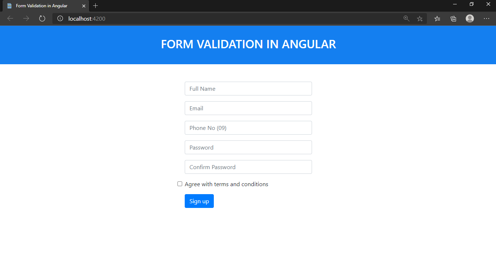
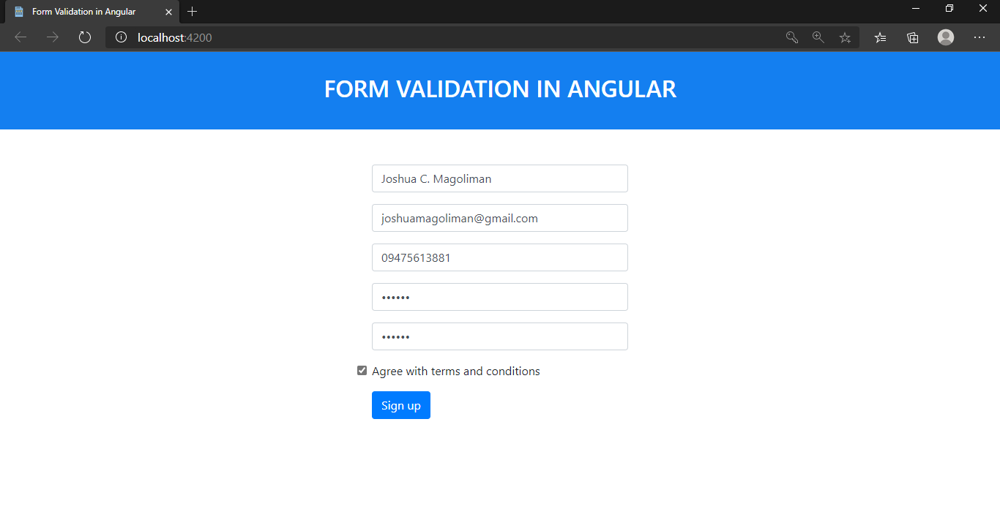

# FORM VALIDATION IN ANGULAR

* Purpose: My Project
* Front End: HTML5, CSS3, Boostrap 4.1.1
* Used JavaScript Framework: Angular
* Responsive Web Design: Yes
* Type of Website: Dynamic

<h2> User Interface Screenshots </h2> 
  
  
  